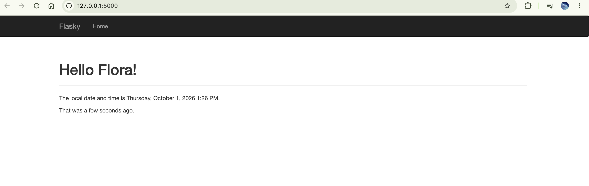
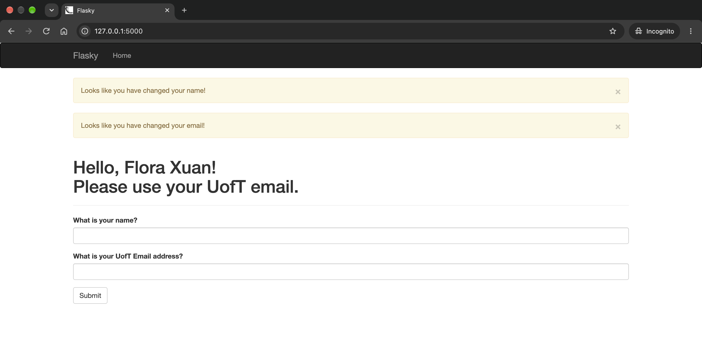

# E444-F2026-PRA3

Author: Flora Xuan

This repo is a clone of https://github.com/miguelgrinberg/flasky, reproducing the examples from
"Flask Web Development" (Miguel Grinberg) for ECE444 PRA3.

Code follows the first edition of the book: https://github.com/miguelgrinberg/flasky-first-edition

## Activity 1.3: Templates, Bootstrap and Flask-Moment (Chapter 3)

Home page with a navbar, a "Hello Flora!" title and the local time in `LLLL` format:

## Activity 1.4: Web forms with a UofT email check (Chapter 4)

After submitting a first and last name with a non-UofT email:

